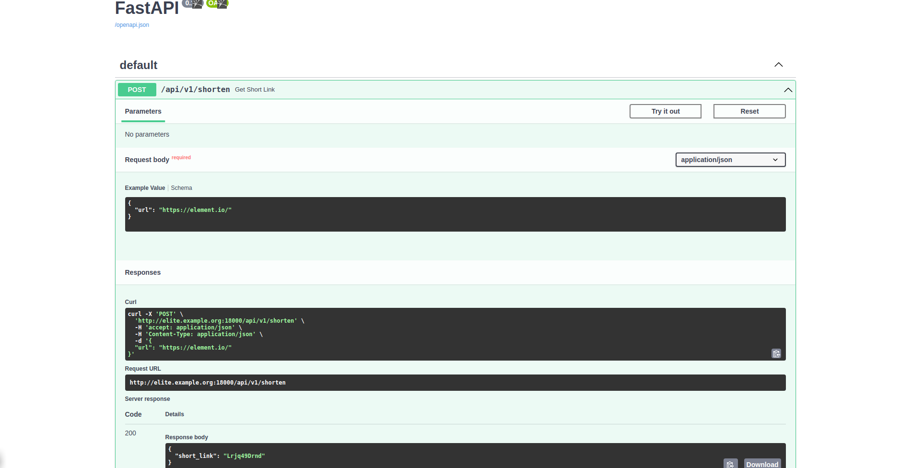

## URL Shortener Service - Using FastAPI

This is a self contained folder structure of a PoC that includes all the dependencies to manage and deploy it as a dockerized microservices. It can also be bind mount on a local volume to create :-
1. Local Single Node Docker Engine/Swarm _DEV-ENV_ 
2. Productionized Docker Swarm _STG-ENV_ and _PROD-ENV_  

#### Tech Stack/Prerequisites And Assumptions

- Docker Engine running with Swarm Mode On/Off
- Docker Compose for defining and running multi-container Docker Apps
- FastAPI Python Framework
- PostgeSQL for persistence data storage 
- Linux/Ubuntu Based Dev, Staging And Production Env

#### How To Run This WebApp Deployment

- To start, clone the repo into a work env folder of choice
```bash
git clone git@github.com:gluzangi/url-shortener-app.git

cd ./url-shortener-app
```

1. Build the WebApp local image with :
```bash
docker image build --no-cache -t 'gluzangi/img:url-shortener' -f Dockerfile .
```
_NOTE : make sure the user running image building task has proper Docker Engine exec permission or exists in sudoers_

2. Deploying a set of microservices (The WebApp) by using `docker-compose` _DEV-ENV_:
```bash
#! /bin/bash
#
# launch API WebApp :
#
docker-compose -f docker-compose.yml -p element up -d

#
# check running set of microservices in the API WebApp stack :
#
docker-compose -f docker-compose.yml -p element ps
       Name                     Command               State                     Ports                   
--------------------------------------------------------------------------------------------------------
element_api_1        uvicorn app.main:app --hos ...   Up      0.0.0.0:18000->8081/tcp,:::18000->8081/tcp
element_db-pgsql_1   docker-entrypoint.sh postgres    Up      5432/tcp

#
# check the running DB schema and data :
#
docker container exec -ti element_db-pgsql_1 bash

root@pgsql:/# psql -U pgadmin -d db_pgsql
psql (14.1 (Debian 14.1-1.pgdg110+1))
Type "help" for help.

db_pgsql=# \dt
             List of relations
 Schema |      Name      | Type  |  Owner  
--------+----------------+-------+---------
 public | shortened_urls | table | pgadmin
(1 row)

#
# verify DB schema :
#
db_pgsql=# \d shortened_urls
                                 Table "public.shortened_urls"
        Column        |            Type             | Collation | Nullable |      Default      
----------------------+-----------------------------+-----------+----------+-------------------
 id                   | uuid                        |           | not null | gen_random_uuid()
 original_url         | character varying(255)      |           | not null | 
 short_link           | character varying(10)       |           | not null | 
 short_link_create_at | timestamp without time zone |           | not null | CURRENT_TIMESTAMP
Indexes:
    "shortened_urls_pkey" PRIMARY KEY, btree (id)
    "ix_shortened_urls_short_link" UNIQUE, btree (short_link)
    "shortened_urls_short_link_key" UNIQUE CONSTRAINT, btree (short_link)

#
# verify shortened-url records :
#
db_pgsql=# SELECT * FROM shortened_urls;
                  id                  |      original_url       | short_link |    short_link_create_at    
--------------------------------------+-------------------------+------------+----------------------------
 c43ae8ea-b7d6-4512-8d3e-5216a37f7a39 | https://element.io/     | Lrjq49Drnd | 2022-01-13 23:24:27.011092
 5c543dfb-1cec-47e2-bd4b-986a51373d6c | https://thenewstack.io/ | uwab5RR_zu | 2022-01-13 23:31:08.394805
 a5a342be-a971-4d47-b49d-d157f5f04bd0 | https://matrix.org/     | tOsZVMeVCN | 2022-01-13 23:38:52.514889

```

3. Create a shortlink with [CURL](https://curl.haxx.se):
```bash

curl -X 'POST' \
  'http://localhost:18000/api/v1/shorten' \
  -H 'accept: application/json' \
  -H 'Content-Type: application/json' \
  -d '{"url": "https://matrix.org/"}' | jq .
{
    "short_link":"tOsZVMeVCN"
}

```

4. Create a shortlink with [httpie](https://httpie.org):
```bash

http POST http://localhost:18000/api/v1/shorten url=https://thenewstack.io/

HTTP/1.1 200 OK
content-length: 27
content-type: application/json
date: Thu, 13 Jan 2022 23:31:51 GMT
server: uvicorn

{
    "short_link": "uwab5RR_zu"
}

```

5. Access the WebApp/URL-SHORTENER API docs :

- SWAGGER-UI:


- REDOC-UI:


6. Test implementation with Vegeta Tool:
```bash

echo "GET http://localhost:18000/api/v1/lookup/uwab5RR_zu" | vegeta attack -duration=300s -rate=10 | vegeta report
Requests      [total, rate, throughput]         3000, 10.00, 10.00
Duration      [total, attack, wait]             5m0s, 5m0s, 36.875ms
Latencies     [min, mean, 50, 90, 95, 99, max]  23.428ms, 34.522ms, 33.24ms, 38.394ms, 41.406ms, 55.848ms, 352.393ms
Bytes In      [total, mean]                     125025000, 41675.00
Bytes Out     [total, mean]                     0, 0.00
Success       [ratio]                           100.00%
Status Codes  [code:count]                      200:3000  
Error Set:
```

#### TODO / RANDOM / UNFINISHED IDEAS :
- Fully transitioning DB Schema into Alembic Migrations

### References

 - [Swagger.IO](https://swagger.io/docs/) - Swagger.IO
 - [Redoc](https://github.com/Redocly/redoc) - Redocly/Redoc

### Tech Stack List

 1. [FastAPI](https://fastapi.tiangolo.com/) - FastAPI Docs
 2. [Docker](https://docs.docker.com/) - Docker Docs
 3. [Docker Compose](https://docs.docker.com/compose/) - Docker Compose Docs
 4. [PostgreSQL Documentation](https://www.postgresql.org/docs/14/index.html) - PGSQL 14 Documentation
 5. [Vegeta](https://github.com/tsenart/vegeta) - Vegeta HTTP Load Testing Tool 


> **NOTE:** Library dependencies for the WebApp and Infrastructure requirements must be resolved during the setup process.

### Author/Developer

-  [Gerald Luzangi](https://github.com/gluzangi/)
